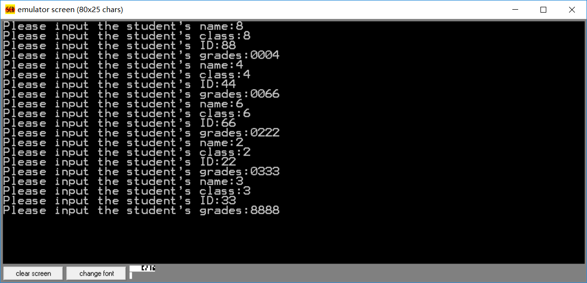
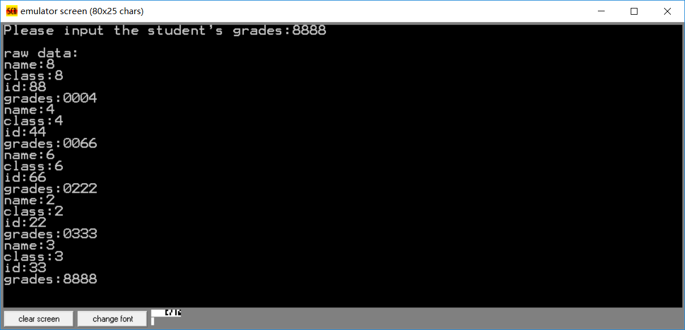
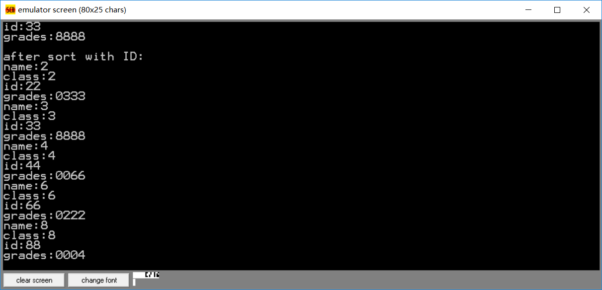
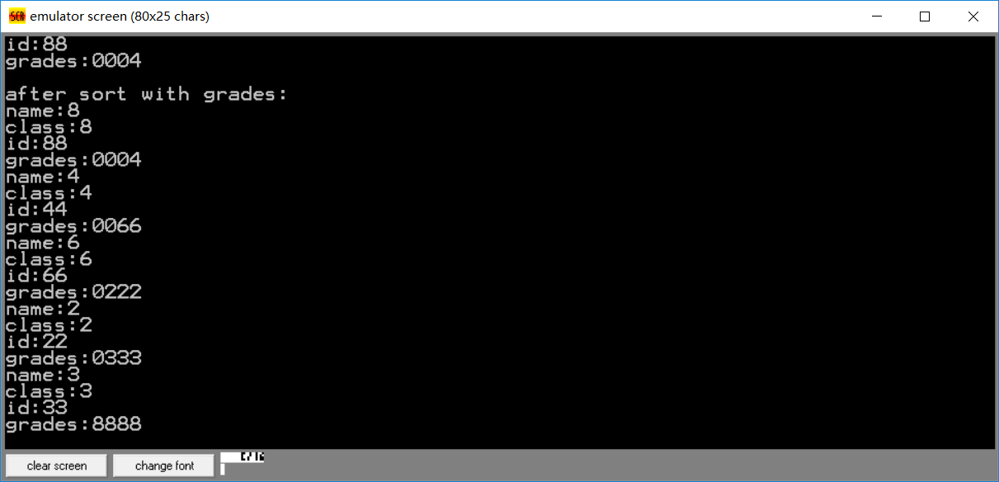
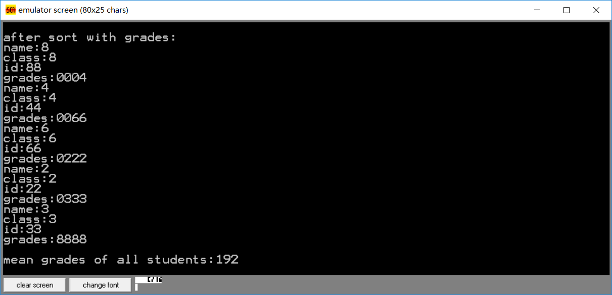
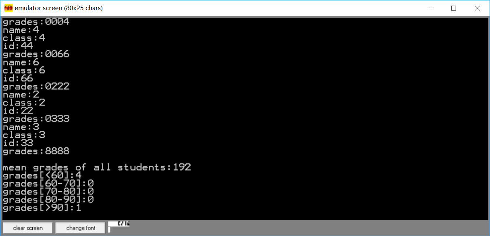

# 学生管理系统

## 题目

一个学生的信息包括姓名、班级、学号、成绩。其中成绩需要精确到一位小数。编写程序实现以下功能：
- 可以录入学生成绩（十进制）
- 可以按要求（学号或成绩）进行排序显示
- 可以统计平均成绩
- 可以统计不及格、60-70、70-80、80-90、90-100各分数段的人数

## 环境

emu8086 4.07

## 源码与思路

### 数据结构与常量

由于emu8086 4.07不支持struct语法，故没有使用struct，直接在内存中定义数据结构，使用偏移量访问

学生信息由姓名、班级、学号和成绩四项组成。前三项的长度题目没有要求，使用常量定义以便修改。成绩要求能够表示一位小数，故设置长度为4，分别表示百位、十位、个位和小数点后一位。学生数量和缓冲区长度也设置为常量，如下：

```
NAME_LENGTH equ 1
CLASS_LENGTH equ 1
ID_LENGTH equ 1
GRADES_LENGTH equ 4
STUDENT_LENGTH equ NAME_LENGTH + CLASS_LENGTH + ID_LENGTH + GRADES_LENGTH
STUDENT_COUNT equ 5
BUF_LENGTH equ 100
```

栈区设置为100字

```
stack segment stack
	dw 100h dup(0)
stack ends
```

数据上，定义变量students保存所有学生信息

```
students db STUDENT_COUNT * STUDENT_LENGTH dup(0)
```

定义一些字符串常量用于输出

```
inputNameMsg db 'Please input the student', 27h, 's name:', '$'
inputClassMsg db 'Please input the student', 27h, 's class:', '$'
inputIDMsg db 'Please input the student', 27h, 's ID:', '$'
inputGradesMsg db 'Please input the student', 27h, 's grades:', '$'
outputNameMsg db 'name:', '$'
outputClassMsg db 'class:', '$'
outputIDMsg db 'id:', '$'
outputGradesMsg db 'grades:', '$'
outputRawData db 'raw data:', '$'
outputSortWithID db 'after sort with ID:', '$'
outputSortWithGrades db 'after sort with grades:', '$'
outputMeanGrades db 'mean grades of all students:', '$'
outputStatistic1 db 'grades[<60]:', '$'
outputStatistic2 db 'grades[60-70]:', '$'
outputStatistic3 db 'grades[70-80]:', '$'
outputStatistic4 db 'grades[80-90]:', '$'
outputStatistic5 db 'grades[>90]:', '$'
```

定义缓冲区

```
buf db BUF_LENGTH dup(0)
```

### 宏

为了方便后面代码的编写，定义了如下宏：

- endl - 用于输出回车换行

```
endl macro
	push ax
	push dx

	mov ah, 02h
	mov dl, 0dh ; output \r
	int 21h
	mov dl, 0ah ; output \n
	int 21h

	pop dx
	pop ax
endm
```

- printstr - 用于输出以`'$'`结尾的字符串

```
printstr macro addr
	push dx
	push ax

	lea dx, addr
	mov ah, 09h ; output a string end with '$'
	int 21h

	pop ax
	pop dx
endm
```

- putc - 用于输出一个字符

```
putc macro addr
	push ax
	push dx

	mov dl, addr
	mov ah, 02h ; output a char
	int 21h

	pop dx
	pop ax
endm
```

- getchar - 读入一个字符并保存

```
getchar macro addr
	push ax

	mov ah, 01h ; input a char with echo
	int 21h
	mov addr, al

	pop ax
endm
```

- pushr - 将四个寄存器压栈

```
pushr macro
	push ax
	push bx
	push cx
	push dx
endm
```

- popr - 将四个寄存器出栈

```
popr macro
	pop dx
	pop cx
	pop bx
	pop ax
endm
```

- exchange - 交换[ax]和[bx]的内容

```
exchange macro
	push bx
	push dx

	push bx
	mov bx, ax
	mov dl, [bx] ; dl = [ax]
	pop bx
	xchg dl, [bx]
	mov bx, ax
	mov [bx], dl

	pop dx
	pop bx
endm
```

- nextStudent - 移动bx使其指向下一个学生

```
nextStudent macro
	push ax
	mov ax, bx
	add ax, STUDENT_LENGTH
	mov bx, ax
	pop ax
endm
```

### 函数

- inputStudent - 输入单个学生详情
  - 输入
    - 单个学生内存地址bx
  - 通过调用函数input将输入的数据保存到内存


```
inputStudent proc
	push bx
	push cx
	; ============================= input name
	printstr inputNameMsg

	mov cx, NAME_LENGTH
	call input
	endl

	; ============================ input class
	printstr inputClassMsg
	
	add bx, NAME_LENGTH
	mov cx, CLASS_LENGTH
	call input
	endl

	; ============================ input ID
	printstr inputIDMsg

	add bx, CLASS_LENGTH
	mov cx, ID_LENGTH
	call input
	endl

	; ============================ input grades
	printstr inputGradesMsg

	add bx, ID_LENGTH
	mov cx, GRADES_LENGTH
	call input
	endl

	pop cx
	pop bx
	ret
inputStudent endp
```

- input - 将输入结果保存到内存
  - 输入
    - 地址bx
    - 需要读入的字符数量cx

```
input proc
	push bx
	push cx
	push dx

	mov dx, 0 ; counter for cx

	jmp inputJudge
	inputLoop:
		getchar [bx]
		inc bx
		inc dx
	inputJudge:
		cmp cx, dx
		ja inputLoop

	pop dx
	pop cx
	pop bx
	ret
input endp
```

- locateStudent - 定位第n个学生的地址
  - 输入
    - 学生下标cx
  - 输出
    - 学生地址bx

```
locateStudent proc
	push cx

	; locate
	lea bx, students
	jmp locateStudentJudge
	locateStudentLoop:
		nextStudent
		dec cx
	locateStudentJudge:
		cmp cx, 0
		ja locateStudentLoop

	pop cx
	ret
locateStudent endp
```

- sort - 以学号或成绩排序
  - 输入
    - 排序基准buf[0]。如果是0表示以学号排序，如果是1表示以成绩排序
  - 使用了冒泡排序法
  - 调用函数locateStudent对指定学生进行定位
  - 调用compare函数进行多字节比较
  - 调用exchangeStudent函数实现冒泡过程中的交换操作

```
sort proc
	pushr
	; simple bubble sort

	mov cx, 0 ; counter of loop
	sortLoop:
		push cx

		mov cx, 0
		mov dx, cx ; dx is the index of comparing student
		inc dx
		; ax = address of students[dx], bx = address of students[cx]
		call locateStudent
		mov ax, bx
		sortLoop2:
			add ax, STUDENT_LENGTH
			pushr
			cmp buf[0], 0
			jne sortWithGrades
				; sort with id
				mov cx, ID_LENGTH
				add ax, NAME_LENGTH + CLASS_LENGTH
				add bx, NAME_LENGTH + CLASS_LENGTH
				jmp sortCompare
			sortWithGrades:
				mov cx, GRADES_LENGTH
				add ax, NAME_LENGTH + CLASS_LENGTH + ID_LENGTH
				add bx, NAME_LENGTH + CLASS_LENGTH + ID_LENGTH
			sortCompare:
			call compare
			popr
			je sortContinue
			ja sortNotEqual
				; if students[dx] < students[cx]
				call exchangeStudent
			sortNotEqual:
				mov cx, dx
				mov bx, ax
			sortContinue:
			inc dx
			cmp dx, STUDENT_COUNT
			jb sortLoop2

		pop cx
		inc cx
		cmp cx, STUDENT_COUNT
		jb sortLoop

	popr
	ret
sort endp
```

- exchangeStudent - 在内存中交换两个学生的信息
  - 输入
    - 学生1的地址ax
    - 学生2的地址bx

```
exchangeStudent proc
	pushr

	mov cx, STUDENT_LENGTH
	sortXchg:
		exchange
		inc ax
		inc bx
		loop sortXchg

	popr
	ret
endp
```

- compare - 多字节比较
  - 输入
    - 数字1的地址ax
    - 数字2的地址bx
    - 需要比较的字节数cx

```
compare proc
	pushr

	jmp compareJudge
	compareLoop:
		dec cx
		; set dx to [ax]
		push bx
		mov bx, ax
		mov dl, [bx]
		pop bx
		; compare
		cmp dl, [bx]
		jne compareEnd
		inc bx
		inc ax
	compareJudge:
		cmp cx, 0
		ja compareLoop
	compareEnd:

	popr
	ret
compare endp
```

- showAllStudents - 显示当前内存中的所有学生信息
  - 调用puts函数实现指定字节数量字符串的输出

```
showAllStudents proc
	pushr

	mov cx, STUDENT_COUNT
	lea bx, students
	showAllStudentsLoop:
		push cx

		printstr outputNameMsg
		mov cx, NAME_LENGTH
		call puts
		endl
		add bx, NAME_LENGTH
		
		printstr outputClassMsg
		mov cx, CLASS_LENGTH
		call puts
		endl
		add bx, CLASS_LENGTH

		printstr outputIDMsg
		mov cx, ID_LENGTH
		call puts
		endl
		add bx, ID_LENGTH

		printstr outputGradesMsg
		mov cx, GRADES_LENGTH
		call puts
		endl
		add bx, GRADES_LENGTH

		pop cx
		loop showAllStudentsLoop

	popr
	ret
showAllStudents endp
```

- puts - 输出内存中指定长度的字符串
  - 输入
    - 字符串基址bx
    - 字符串长度cx

```
puts proc
	push bx
	push cx

	jmp putsJudge
	putsLoop:
		dec cx
		putc [bx]
		inc bx
	putsJudge:
		cmp cx, 0
		ja putsLoop

	pop cx
	pop bx
	ret
endp
```

- calculateMeanGrade - 计算平均成绩
  - 使用buf[0-7]的内存保存结果
  - 使用字节而不是数值来保存结果
  - 多次调用函数addStudentGrades使buf数值上升
  - 计算均值时先将buf[0-7]中的总成绩字节结果转换为数值结果保存在dx:ax中，计算均值后只保留ax中的数值内容即可
	- 因为成绩使用四字节保存，理论学生成绩最大值为999.9，使用16位乘除法实现计算防止溢出
  - 调用函数printAX输出ax中的数值内容

```
calculateMeanGrade proc
	pushr

	; clear buf[0-7]
	mov bx, 0
	calculateMeanGradeClearLoop:
		mov buf[bx], '0'
		inc bx
		cmp bx, 8
		jb calculateMeanGradeClearLoop

	; calculate sum
	mov cx, STUDENT_COUNT
	lea bx, students
	calculateMeanGradeLoop:
		call addStudentGrades
		nextStudent
		loop calculateMeanGradeLoop

	; change byte to decimal
	mov ax, 0 ; dx:ax is the decimal result
	mov bx, 0 ; index of buf
	mov cx, 8 ; counter for loop
	mov dx, 0 ; dx:ax is the decimal result
	calculateMeanGradeByteToDecimalLoop:
		push bx
		mov bx, 10
		mul bx
		pop bx
		push cx
		mov ch, 0
		mov cl, buf[bx]
		sub cx, '0'
		add ax, cx
		jnc calculateMeanGradeNotCarry
			; add ax, cx generate carry bit
			inc dx
		calculateMeanGradeNotCarry:
		inc bx
		pop cx
		loop calculateMeanGradeByteToDecimalLoop

	; get mean number in decimal
	push bx
	mov bx, STUDENT_COUNT
	div bx
	pop bx
	mov dx, 0
	; now ax is the result, output it, change decimal to byte
	call printAX

	popr
	ret
endp
```

- addStudentGrades - 把当前学生成绩加到buf[0-7]中
  - 输入
    - 当前学生基址bx
    - 当前总成绩buf[0-7]
  - 输出
    - 累加后的总成绩buf[0-7]
  - 内含一个进位循环，当判定当前位的字节超过字符`'9'`时进位


```
addStudentGrades proc
	pushr
	
	; bx is pointer of student's grades
	mov ax, bx
	add ax, STUDENT_LENGTH - 1
	mov bx, ax

	mov cx, 8
	addStudentGradesLoop:
		mov al, [bx]
		; set ah to buf[cx - 1]
		push bx
		mov bx, cx ; bx is the pointer of buf
		dec bx
		mov ah, buf[bx]
		; now ah = buf[cx - 1]
		add ah, al
		sub ah, '0'
		mov buf[bx], ah

		mov dx, cx ; may need ++buf[dx]
		sub dx, 2
		jmp addStudentGradesJudge
		addStudentGradesProc:
			; buf[bx] -= 10
			sub ah, 10
			mov buf[bx], ah
			; ++buf[bx - 1]
			dec bx
			mov ah, buf[bx]
			inc ah
			mov buf[bx], ah
		addStudentGradesJudge:
			cmp ah, '9'
			ja addStudentGradesProc
		pop bx ; bx is the pointer of student's grades

		dec bx
		cmp cx, 8 - GRADES_LENGTH + 1
		je addStudentGradesEnd
		loop addStudentGradesLoop

	addStudentGradesEnd:
	popr
	ret
endp
```

- printAX - 以字节形式输出ax中的数值内容
  - 因为成绩为4位数，所以仅输出4位
  - 判定非最后一位为0时不输出

```
printAX proc
	pushr

	mov bx, 1000
	div bx
	cmp al, 0
	je notShow1
		add al, '0'
		putc al
	notShow1:
	mov ax, dx
	mov bx, 100
	div bl
	cmp al, 0
	je notShow2
		add al, '0'
		putc al
	notShow2:
	mov al, ah
	mov ah, 0
	mov bx, 10
	div bl
	cmp al, 0
	je notShow3
		add al, '0'
		putc al
	notShow3:
	add ah, '0'
	putc ah

	popr
	ret
endp
```

- printStatistic - 输出统计结果
  - 使用5个循环分别计算5个成绩区间的学生数量
  - 学生数量以数值形式保存在ax中，调用printAX函数以输出

```
printStatistic proc
	pushr

	mov ax, 0 ; counter of result
	lea bx, students
	mov cx, STUDENT_COUNT
	printLoop1:
		cmp [bx + STUDENT_LENGTH - 4], '1'
		jnb loop1End
		cmp [bx + STUDENT_LENGTH - 3], '6'
		jnb loop1End
			; < 60
			inc ax
		loop1End:
		nextStudent
		dec cx
		cmp cx, 0
		ja printLoop1
	printstr outputStatistic1
	call printAX
	endl

	mov ax, 0 ; counter of result
	lea bx, students
	mov cx, STUDENT_COUNT
	printLoop2:
		cmp [bx + STUDENT_LENGTH - 4], '1'
		jnb loop2End
		cmp [bx + STUDENT_LENGTH - 3], '6'
		jb loop2End
		cmp [bx + STUDENT_LENGTH - 3], '7'
		jnb loop2End
			; 60-70
			inc ax
		loop2End:
		nextStudent
		dec cx
		cmp cx, 0
		ja printLoop2
	printstr outputStatistic2
	call printAX
	endl

	mov ax, 0 ; counter of result
	lea bx, students
	mov cx, STUDENT_COUNT
	printLoop3:
		cmp [bx + STUDENT_LENGTH - 4], '1'
		jnb loop3End
		cmp [bx + STUDENT_LENGTH - 3], '7'
		jb loop3End
		cmp [bx + STUDENT_LENGTH - 3], '8'
		jnb loop3End
			; 70-80
			inc ax
		loop3End:
		nextStudent
		dec cx
		cmp cx, 0
		ja printLoop3
	printstr outputStatistic3
	call printAX
	endl

	mov ax, 0 ; counter of result
	lea bx, students
	mov cx, STUDENT_COUNT
	printLoop4:
		cmp [bx + STUDENT_LENGTH - 4], '1'
		jnb loop4End
		cmp [bx + STUDENT_LENGTH - 3], '8'
		jb loop4End
		cmp [bx + STUDENT_LENGTH - 3], '9'
		jnb loop4End
			; 80-90
			inc ax
		loop4End:
		nextStudent
		dec cx
		cmp cx, 0
		ja printLoop4
	printstr outputStatistic4
	call printAX
	endl

	mov ax, 0 ; counter of result
	lea bx, students
	mov cx, STUDENT_COUNT
	printLoop5:
		cmp [bx + STUDENT_LENGTH - 4], '1'
		jnb loopInc
		cmp [bx + STUDENT_LENGTH - 3], '9'
		jb loop5End
			; 90-100
		loopInc:
			inc ax
		loop5End:
		nextStudent
		dec cx
		cmp cx, 0
		ja printLoop5
	printstr outputStatistic5
	call printAX
	endl

	popr
	ret
endp
```

- main
  - 循环调用inputStudent实现输入
  - 调用showAllStudents输出原始数据
  - 调用sort，通过设置buf[0]实现两种排序
  - 调用calculateMeanGrade输出平均成绩
  - 调用printStatistic输出统计结果
  - 使用4c00h中断返回系统

```
main:
	; load ds
	mov ax, data
	mov ds, ax

	mov cx, STUDENT_COUNT
	lea bx, students
	inputStudentLoop:
		call inputStudent
		nextStudent
		loop inputStudentLoop
	endl

	printstr outputRawData
	endl
	call showAllStudents
	endl

	mov buf[0], 0 ; sort with ID
	call sort
	printstr outputSortWithID
	endl
	call showAllStudents
	endl

	mov buf[0], 1 ; sort with grades
	call sort
	printstr outputSortWithGrades
	endl
	call showAllStudents
	endl

	printstr outputMeanGrades
	call calculateMeanGrade
	endl

	call printStatistic

	; back to system
	mov ax, 4c00h
	int 21h
```

## 运行结果

### 输入数据

为了方便测试，设置学生名字、班级的长度均为1字节，学号2字节，成绩4字节，学生数量设置为5

5个学生的数据如下：

```json
[
	{
		"name": "8",
		"class": "8",
		"id": "88",
		"grades": "0004"
	},
	{
		"name": "4",
		"class": "4",
		"id": "44",
		"grades": "0066"
	},
	{
		"name": "6",
		"class": "6",
		"id": "66",
		"grades": "0222"
	},
	{
		"name": "2",
		"class": "2",
		"id": "22",
		"grades": "0333"
	},
	{
		"name": "3",
		"class": "3",
		"id": "33",
		"grades": "8888"
	}
]
```

因为成绩使用4位表示，所以未满四位使用0填充

输入效果如图：



### 输出

- 输出原学生信息



- 输出按学号排序结果



- 输出按成绩排序结果



- 输出平均成绩



- 输出统计数据

